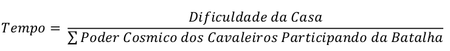

<dl>

<strong>
UNIVERSIDADE ESTADUAL DO PIAUÍ 
CENTRO DE TECNOLOGIA E URBANISMO 
CIÊNCIA DA COMPUTAÇÃO 
TEORIA DOS GRAFOS 
Prof. Marcus Vinicius 

2018-2

</strong>

</dl>

### TTRABALHO PRATICO II – BUSCA A*

**por Lucas Pinheiro de Oliveira**

---

#### 1 Descrição:

“Durante o torneio da Guerra Galáctica, os Cavaleiros de Bronze descobrem que
Saori é a reencarnação de Atena e que o Grande Mestre tentou matá-la ainda bebê.
Decididos a apoiar Saori, os Cavaleiros de Bronze partem para o Santuário para
enfrentar o Grande Mestre.

Ao chegar ao Santuário, Saori e os Cavaleiros são recepcionados por Tremy, um
Cavaleiro de Prata, que ataca o grupo e atinge Saori com uma flecha mortal.

Para salvar Atena, os Cavaleiros devem percorrer um caminho composto pelas 12
Casas do Zodíaco, cada uma protegida por um Cavaleiro de Ouro, e chegar à casa do
Grande Mestre, o único capaz de remover a flecha do peito de Saori. Para complicar
ainda mais, os Cavaleiros tem um prazo máximo de 12 horas para realizar essa tarefa!

O seu objetivo é ajudar Seiya, Shiryu, Hyoga, Shun e Ikki a passar pelas 12 Casas do
Zodíaco, derrotando todos os Cavaleiros de Ouro e salvando Atena o mais rápido
possível!”.

O Trabalho 1 consiste em implementar um agente capaz de guiar autonomamente Seiya,
Shiryu, Hyoga, Shun e Ikki pelas 12 Casas do Zodíaco, planejando a melhor forma de
derrotar os 12 Cavaleiros de Ouro e salvar Atena. Para isso, você deve utilizar o
__algoritmo de busca heurística A*__.

O agente deve ser capaz de calcular automaticamente a __melhor rota__ para __percorrer as__
__12 Casas do Zodíaco e derrotar os 12 Cavaleiros de Ouro no menor tempo possível__.

O mapa das __12 Casas do Zodíaco__ é mostrado na Figura 3.

No caminho das 12 Casas do Zodíaco existem 3 __tipos de terrenos:__ montanhoso (região
cinza escuro), plano (região cinza) e rochoso (região cinza claro).

Para passar por cada tipo de terreno, os Cavaleiros gastam uma determinada quantidade
de tempo:

- __Montanhoso:__ +200 minutos
- __Plano:__ +1 minuto
- __Rochoso:__ +5 minutos

Os Cavaleiros de Bronze iniciam a sua jornada na __entrada do santuário__ (região em
vermelho no mapa) e terminam ao chegar à casa do __Grande Mestre__ (região verde no
mapa).

Ao chegar a uma Casa do Zodíaco, o agente deve __decidir quais Cavaleiros vão lutar__
contra o Cavaleiro de Ouro que protege a casa. Cada Cavaleiro de Ouro apresenta um
__nível de dificuldade__ diferente. Este nível determina o tempo gasto pelos Cavaleiros de
Bronze para pode vencê-lo e avançar para a próxima Casa.

A Tabela 1 mostra os níveis de dificuldade das 12 Casas do Zodíaco.

O __número de Cavaleiros de Bronze__ participando das batalhas contra os Cavaleiros de
Ouro influência o tempo gasto na batalha. Além disso, cada Cavaleiro possui um
determinado nível de __poder cósmico__ que também influencia no tempo gasto nas
batalhas. Quanto mais Cavaleiros lutando, mais rápido o Cavaleiro de Ouro será
derrotado.

A Tabela 2 mostra o poder cósmico dos Cavaleiros de Bronze.

O tempo gasto nas batalhas contra os Cavaleiros de Ouro é dado por:

Além do poder cósmico, cada Cavaleiro de Bronze também possui __5 pontos de energia.__
Ao participar de uma batalha, o Cavaleiro perde -1 ponto de energia. Se o Cavaleiro
perder todos os pontos de energia, ele morre.

Neste trabalho existem dois problemas distintos:

1. Encontrar o melhor caminho para passar pelas 12 Casa do Zodíaco e
chegar até a Casa do Grande Mestre;

2. Encontrar a melhor ordem de equipes para lutar contra os Cavaleiros de
Bronze.

Os dois problemas podem ser resolvidos individualmente ou tratando ambos em
um único problema. Você deve definir a melhor maneira de estruturar a sua
solução